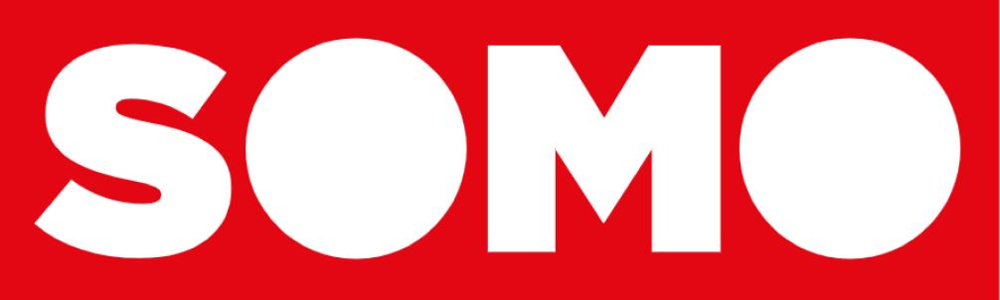

# Project Information Design
<p align="center">
  
</p>

## Over dit project 📊
Dit project bevat een site voor het SOMO project
...Hier komt ooit nog meer toelichting...

### Concept 🏰
Dit project bevat een site die belastingontwijking uitlegt met betrekking tot Mozambique. <br>
De data die gebruikt wordt komt van het bedrijf [SOMO](https://www.somo.nl/nl/)

...Hier komt een beschrijving van wat het is...


## Installatie 💻
### Aan de slag
Wil je aan de slag met dit project? Zorg er dan eerst voor dat je zeker weet dat je [Git](https://git-scm.com/book/en/v2/Getting-Started-Installing-Git), [Node](https://nodejs.org/en/download/) en [NPM](https://docs.npmjs.com/downloading-and-installing-node-js-and-npm) hebt geïnstalleerd op jouw computer.

Voer dan de volgende stappen uit: <br>
1.	Open een terminal en navigeer naar een map waar jij deze repository in wilt opslaan.
2.	Clone de repository:
```
git clone https://github.com/ArisRosbach/tech-track-22-23
```
3.  Wanneer dit is gelukt heb je de repository op je eigen computer staan. Navigeer binnen deze repository in de terminal. Je wilt nu alle packages installeren die je nodig hebt voor deze feature. Om dit project vervolgens te laten werken voer je het volgende commando uit: <br>
```
npm install
```
4.	Als je het project wilt gebruiken tik dan het volgende in je terminal:
```
npm run dev
```
In de terminal vind je vervolgens een link naar een localhost. Open deze in je browser om de applicatie te zien.


## Documentatie 📚
De documentatie van dit project kun je vinden in de [wiki](https://github.com/ArisRosbach/project-information-design/wiki) van deze repository. <br>
...Hier lees je over ...


## Lincense ⚖
Deze repository is licensed onder de [MIT License](https://github.com/ArisRosbach/project-information-design/blob/main/LICENSE)
<p align="center">
  
</p>

## Contact ✉
Developer: <br>
Naam -  Aris Rosbach <br>
Email - aris.rosbach@hva.nl <br>
Project - https://github.com/ArisRosbach/project-information-design <br>

Designers: <br>
Naam -  Sofie Berger <br>
Email - sofie.berger@hva.nl <br>
Naam -  Maxime Kempkes <br>
Email - maxime.kempkes@hva.nl <br>
Naam -  Fleur Oostingh <br>
Email - fleur.oostingh@hva.nl
